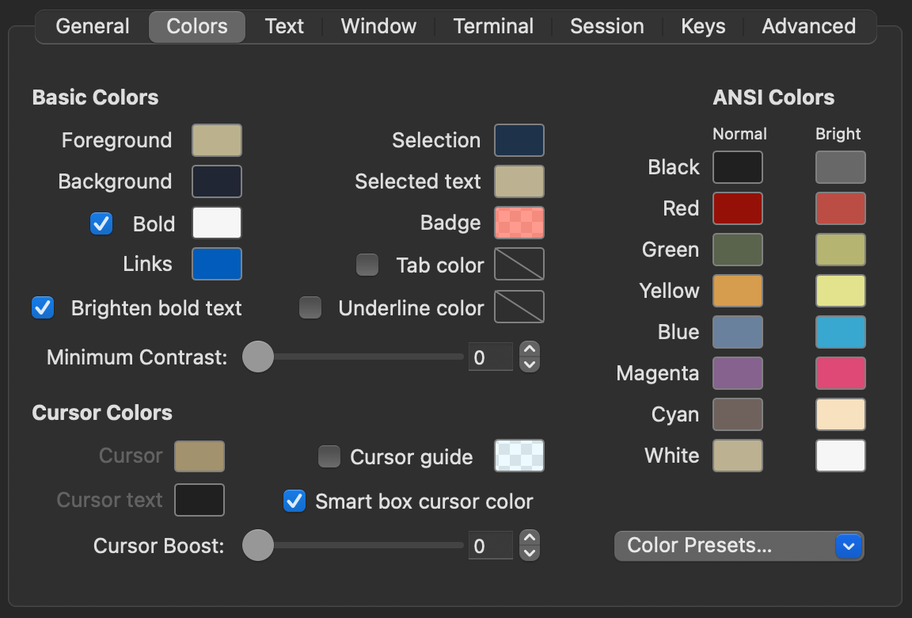
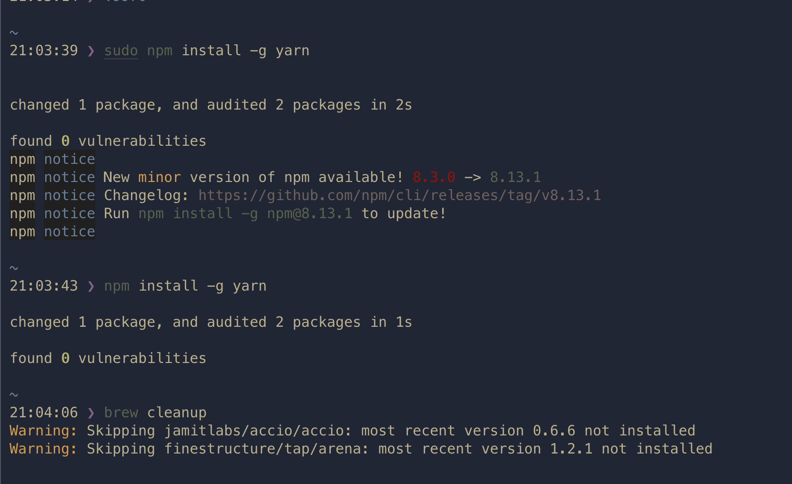

# ciapre.itermcolors

Ciapre color scheme for iTerm2

color pallet:

screenshot:

### Installation

1. Download this repo as zip, `download`
2. Extract to a folder
3. On Item2, open `Preferences` via `Command+,`
4. Then on Tab Profiles > Color > Color Presets... > Import... select ciapre.itermcolors file and enjoy!
